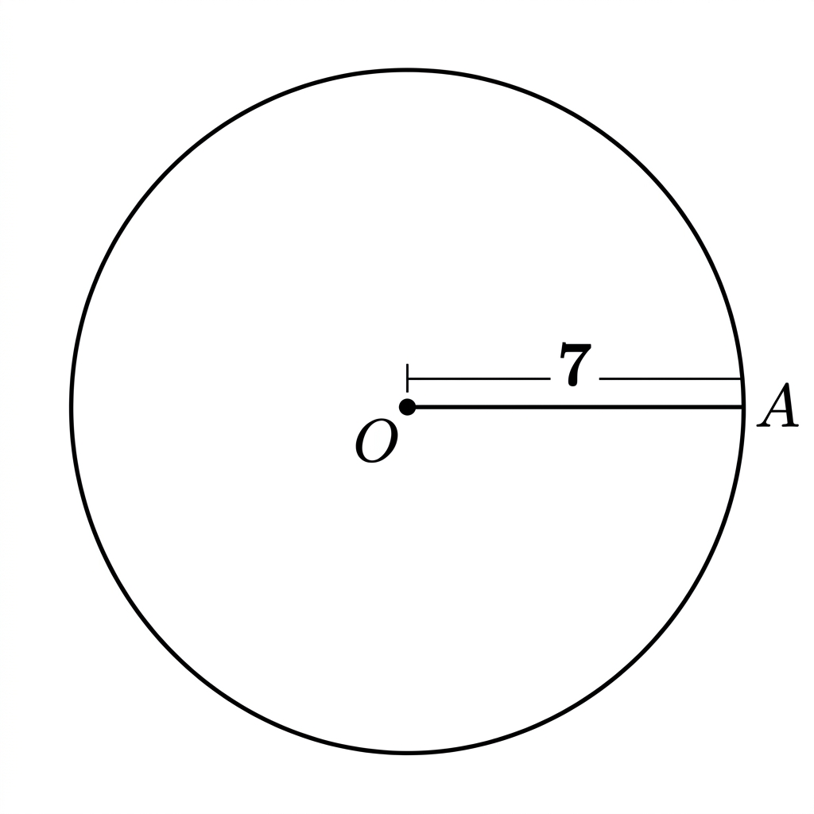
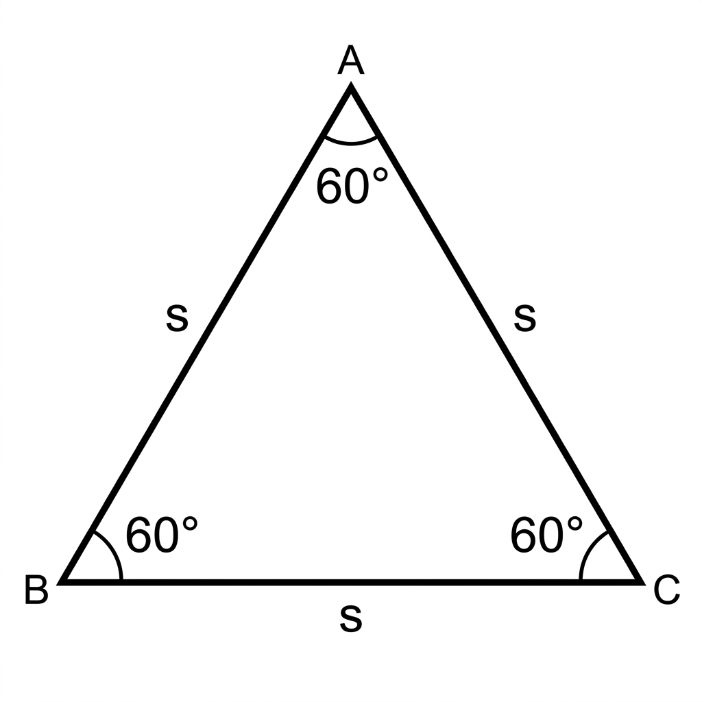
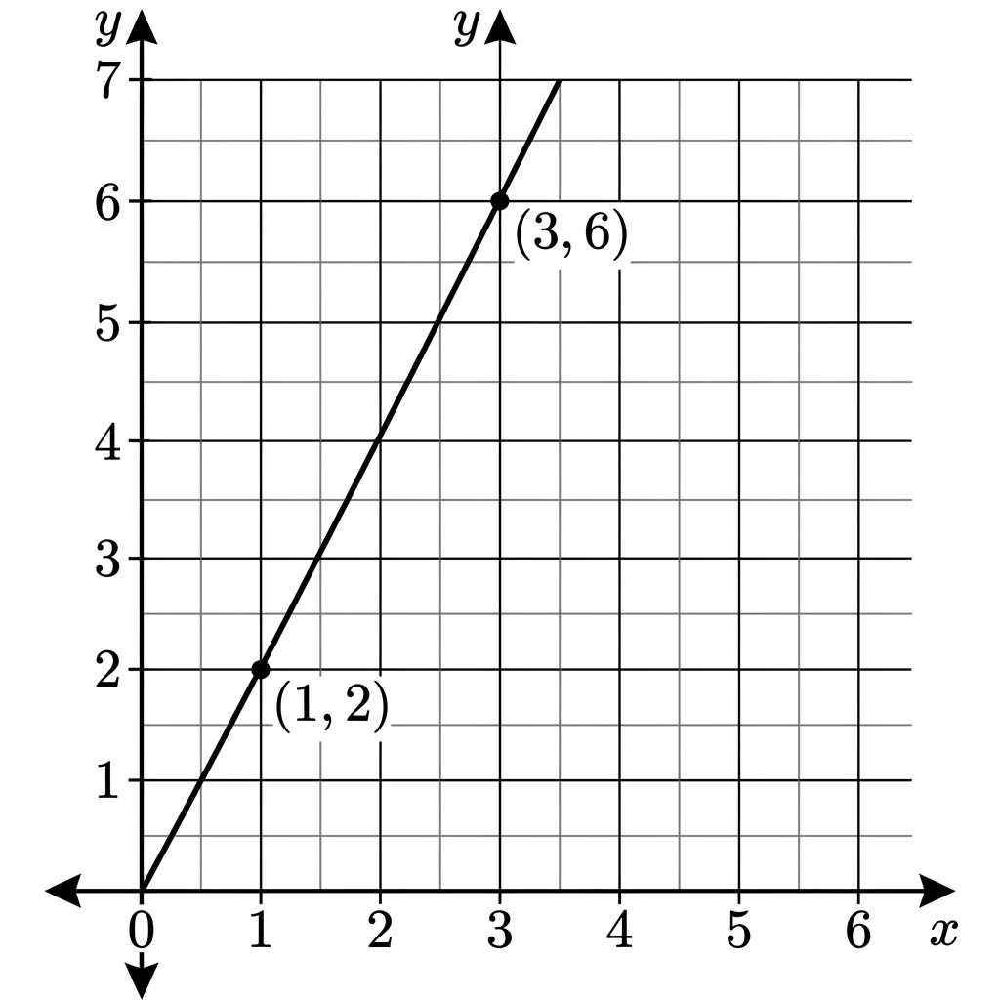
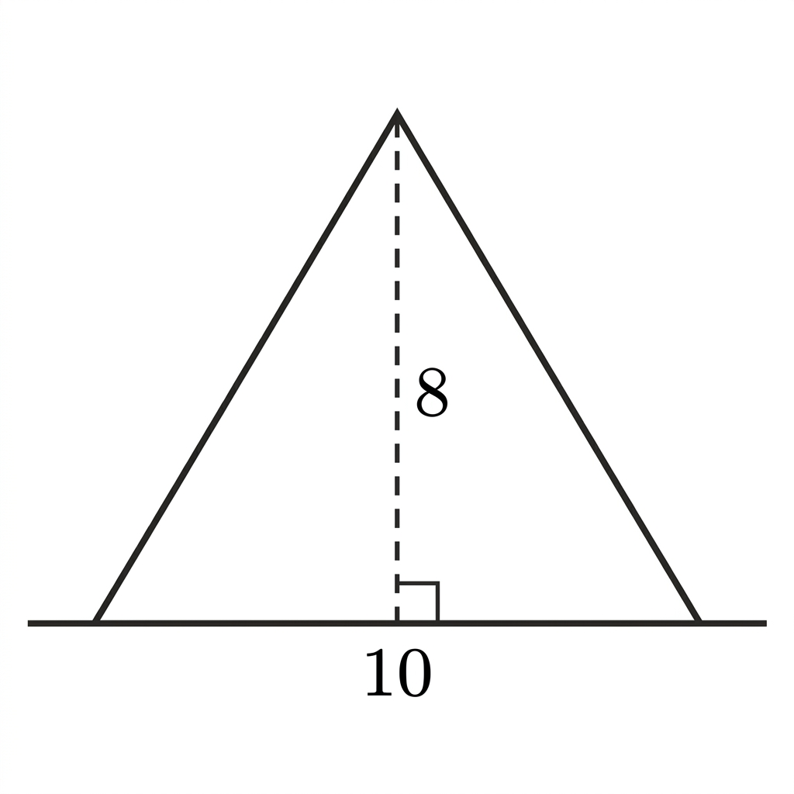
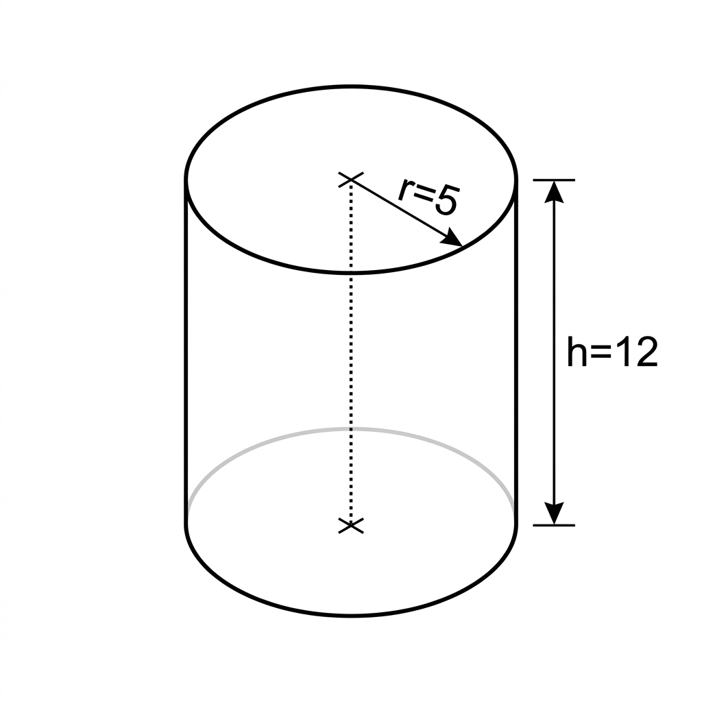
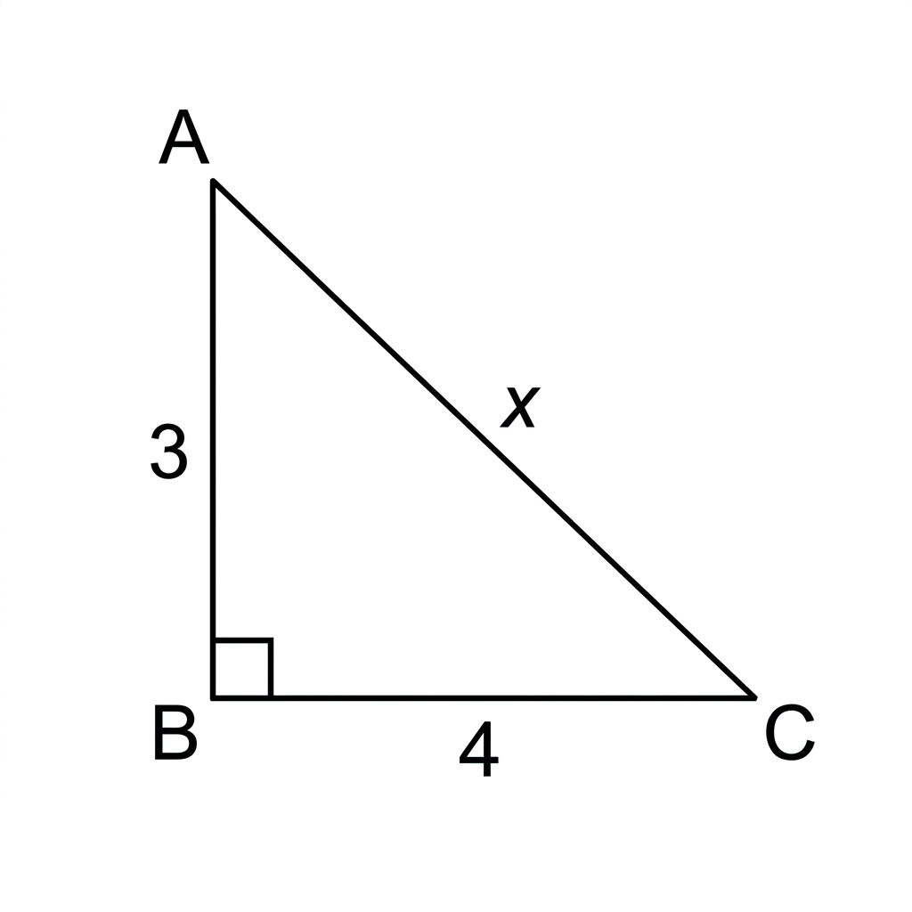
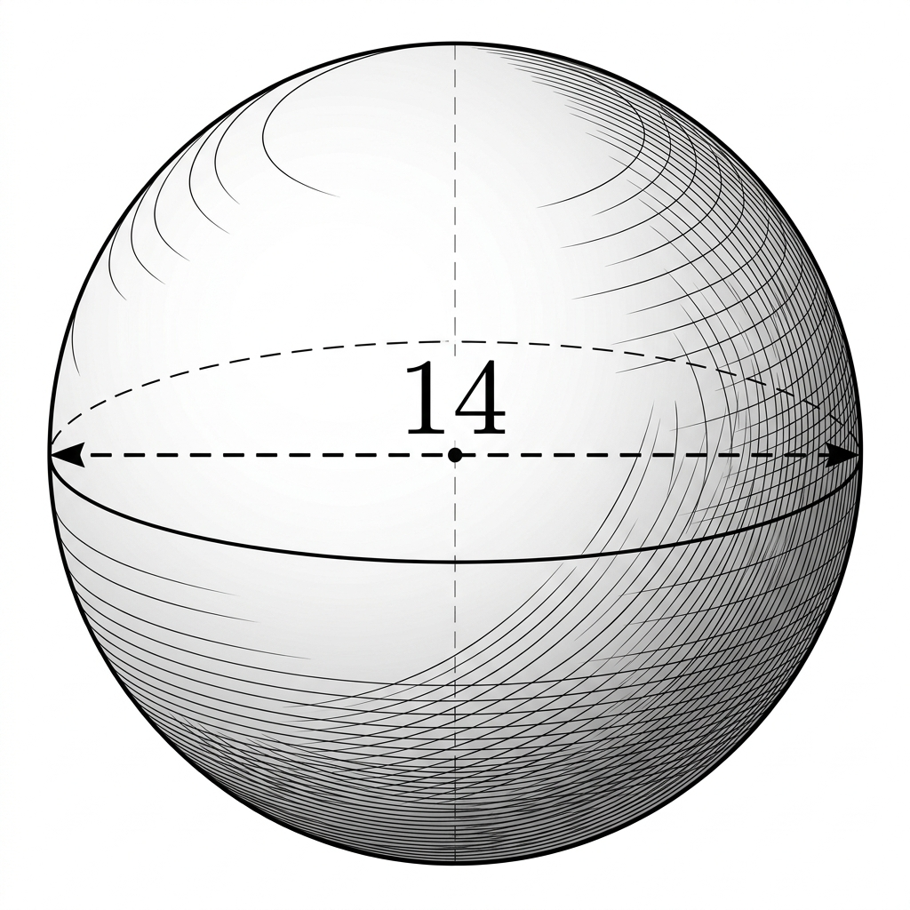
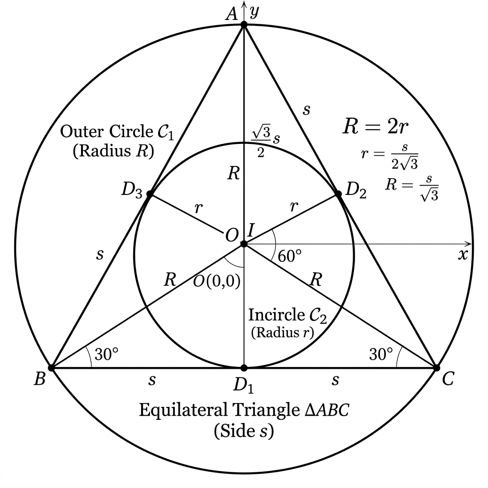
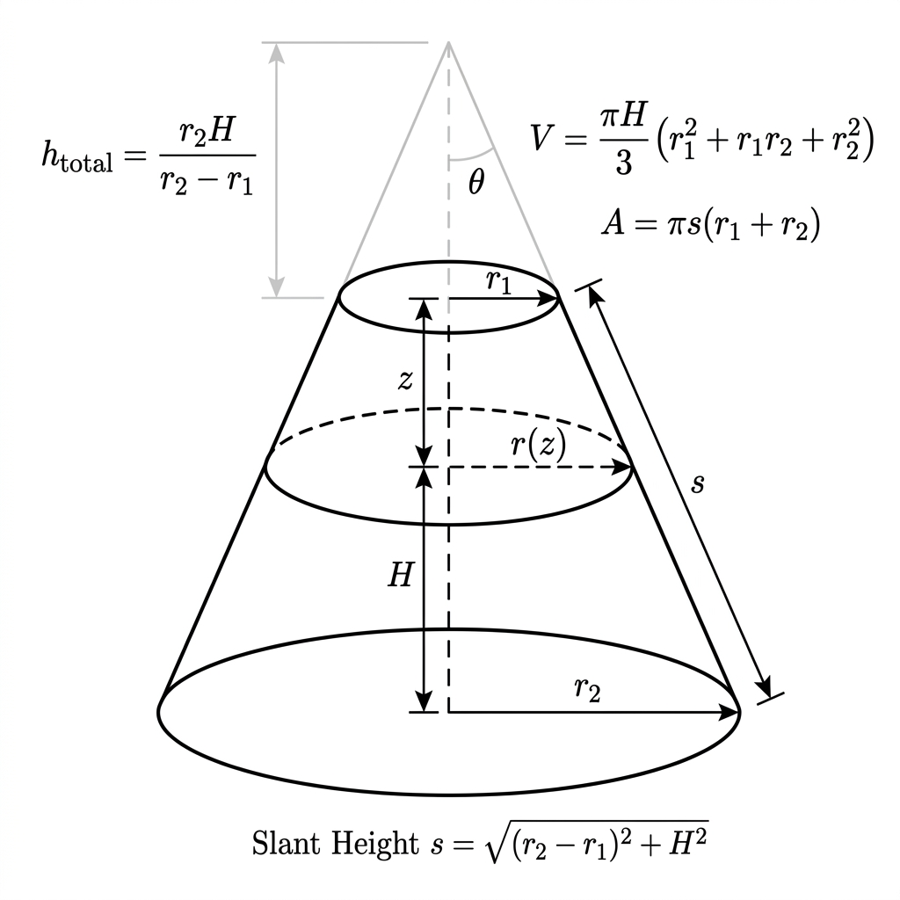
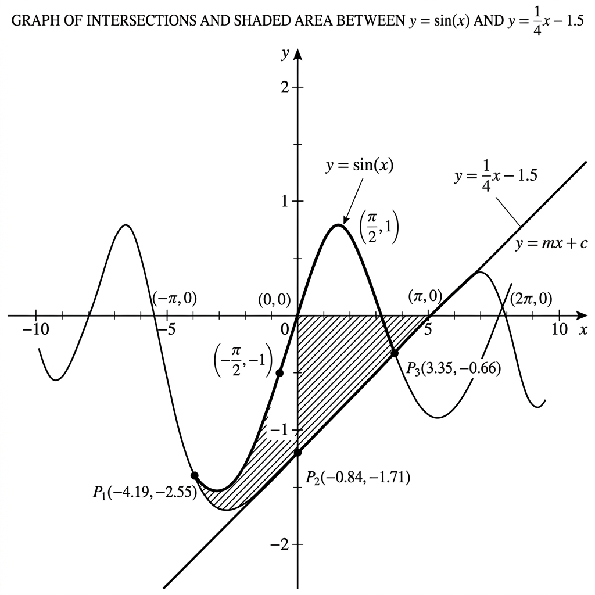

## Q1
Calculate the area of the circle shown in the diagram if the radius $r = 7$ cm. (Use $\pi \approx 3.14$)

- [ ] 43.96 cm²
- [x] 153.86 cm²
- [ ] 144.00 cm²
- [ ] 49.00 cm²

**difficulty:** medium
**points:** 10

## Q2
In the equilateral triangle shown, if one side $s = 10$ units, what is the altitude (height) of the triangle?

- [ ] 5 units
- [ ] $5\sqrt{2}$ units
- [x] $5\sqrt{3}$ units
- [ ] 10 units

**difficulty:** medium
**points:** 10

## Q3
Based on the provided graph, what is the slope ($m$) of the line?

- [x] 0.5
- [ ] 1.0
- [ ] 2.0
- [ ] -0.5

**difficulty:** medium
**points:** 10

## Q4
Find the area of the triangle in the diagram where base $b = 12$ and height $h = 5$.

- [ ] 60
- [x] 30
- [ ] 17
- [ ] 25

**difficulty:** medium
**points:** 10

## Q5
A cylinder has a radius of 4 cm and a height of 10 cm. If a smaller cylinder of radius 2 cm is removed from its center (as shown), what is the remaining volume?

- [ ] $160\pi$ cm³
- [ ] $40\pi$ cm³
- [x] $120\pi$ cm³
- [ ] $80\pi$ cm³

**difficulty:** hard
**points:** 20

## Q6
In the right-angled triangle $ABC$, $AB = 8$ and $BC = 15$. Find the length of the hypotenuse $AC$.

- [ ] 16
- [x] 17
- [ ] 23
- [ ] 19

**difficulty:** hard
**points:** 20

## Q7
A sphere of radius $R$ is perfectly inscribed inside a cube. What is the ratio of the volume of the sphere to the volume of the cube?

- [ ] $\pi/4$
- [x] $\pi/6$
- [ ] $\pi/3$
- [ ] $2\pi/3$

**difficulty:** hard
**points:** 20

## Q8
In the diagram, an equilateral triangle is inscribed in a large circle of radius $R$, and a smaller circle of radius $r$ is inscribed in the triangle. Find the ratio of the area of the outer circle to the area of the inner circle.

- [ ] 2:1
- [ ] 3:1
- [x] 4:1
- [ ] 9:1

**difficulty:** ultra-hard
**points:** 50

## Q9
Calculate the volume of the frustum of a cone where the top radius $r_1 = 3$, bottom radius $r_2 = 6$, and height $H = 4$.

- [ ] $63\pi$
- [ ] $72\pi$
- [x] $84\pi$
- [ ] $108\pi$

**difficulty:** ultra-hard
**points:** 50

## Q10
The graph shows the intersection of $y = \sin(x)$ and $y = \frac{1}{4}x - 1.5$. Which of the following best approximates the x-coordinate of the point $P_3$ shown in the shaded region?

- [ ] 1.57
- [ ] 3.14
- [x] 3.35
- [ ] 4.19

**difficulty:** ultra-hard
**points:** 50

## Answer Key

### Q1
The area of a circle is given by $A = \pi r^2$. For $r=7$, $A = 3.14 \times 49 = 153.86$ cm².

### Q2
The altitude of an equilateral triangle with side $s$ is $h = \frac{\sqrt{3}}{2}s$. For $s=10$, $h = 5\sqrt{3}$.

### Q3
Slope $m = \frac{\Delta y}{\Delta x}$. Checking the points on the graph, the rise is 1 for a run of 2, so $m = 0.5$.

### Q4
Area of a triangle is $A = \frac{1}{2}bh = \frac{1}{2} \times 12 \times 5 = 30$.

### Q5
Total volume = $\pi R^2 H = \pi(4^2)(10) = 160\pi$. 
Inner volume = $\pi r^2 H = \pi(2^2)(10) = 40\pi$.
Remaining volume = $160\pi - 40\pi = 120\pi$.

### Q6
Using Pythagorean theorem: $AC^2 = AB^2 + BC^2 = 8^2 + 15^2 = 64 + 225 = 289$. 
$AC = \sqrt{289} = 17$.

### Q7
Cube side $a = 2R$. 
Volume of sphere = $\frac{4}{3}\pi R^3$. 
Volume of cube = $(2R)^3 = 8R^3$. 
Ratio = $\frac{4/3 \pi R^3}{8R^3} = \frac{\pi}{6}$.

### Q8
For an equilateral triangle in a circle of radius $R$, the side $s = R\sqrt{3}$. 
The inradius $r = \frac{s}{2\sqrt{3}} = \frac{R\sqrt{3}}{2\sqrt{3}} = \frac{R}{2}$. 
The ratio of areas is $(R/r)^2 = (R / (R/2))^2 = 2^2 = 4$. So 4:1.

### Q9
Volume of a frustum $V = \frac{\pi H}{3}(r_1^2 + r_1r_2 + r_2^2)$. 
$V = \frac{4\pi}{3}(3^2 + 3 \times 6 + 6^2) = \frac{4\pi}{3}(9 + 18 + 36) = \frac{4\pi}{3}(63) = 4\pi \times 21 = 84\pi$.

### Q10
By observing the graph and the labeled intersection points, $P_3$ is marked at approximately $(3.35, -0.66)$.
